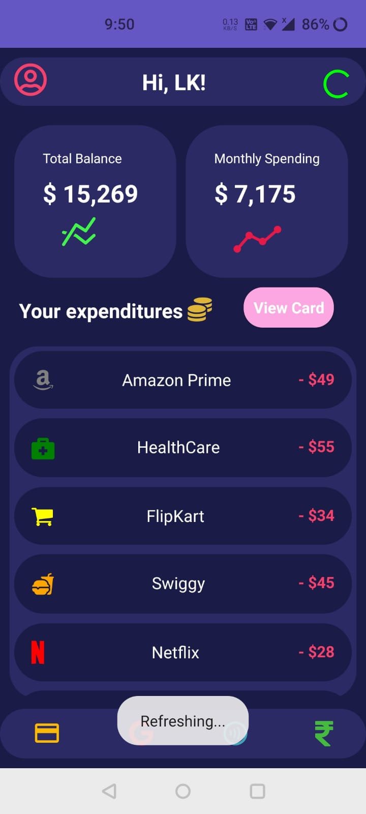
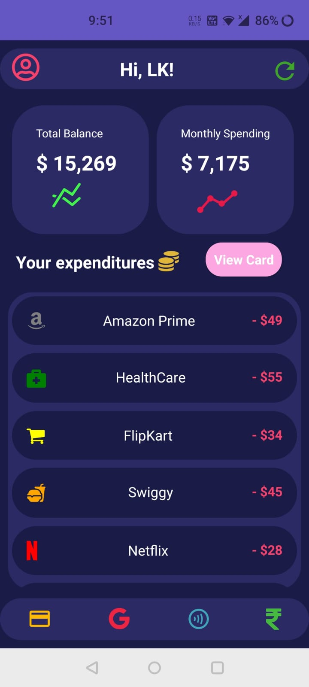
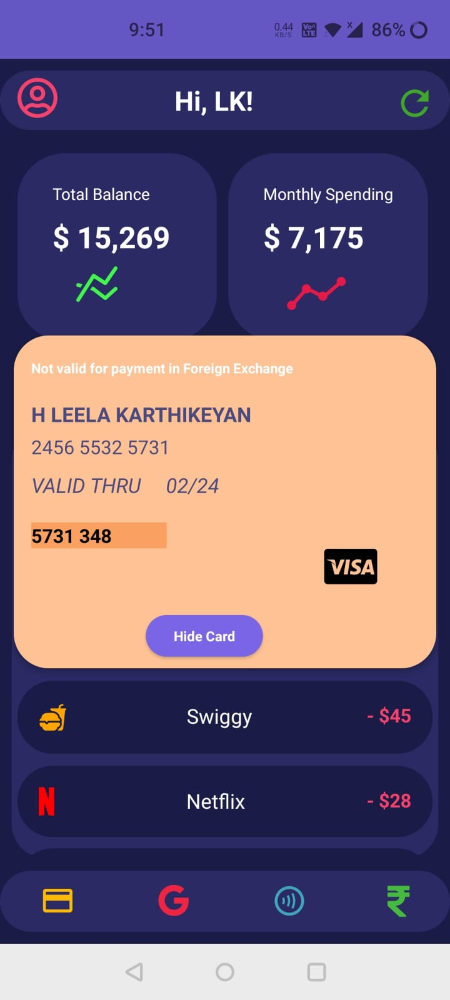
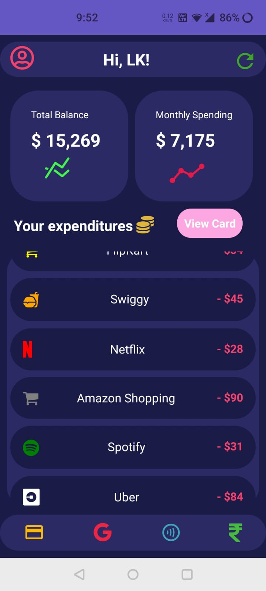

# Mobile Bank App UI ✔
## About
This Mobile Bank App is made using React Native which has a design inspired by this [dribble  design](https://dribbble.com/shots/13547910-Mobile-bank-App-Design).

## Images of the App
- This is the screen when we open the App, Here we can the see the Activity indicator in top right corner when App loads initially :

- Now we can see the refresh Icon, instead of loader :

- When we press the View card button , we can see the details of your card :

- Used a ScrollView to display the expenditures :

#### In future, I will add many new features 👍
